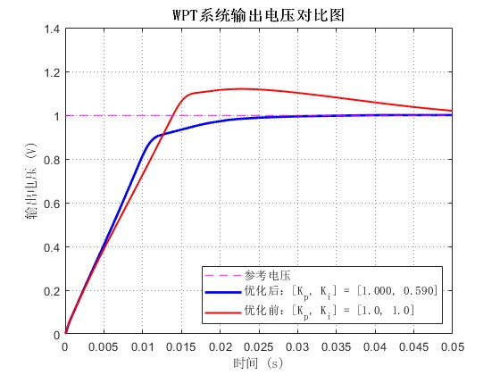

基于 PSO 算法的 WPT 系统 PI 控制器参数优化

📖 项目简介

本项目致力于解决无线电能传输（Wireless Power Transfer, WPT）系统中 PI 控制器参数整定困难的问题。传统的人工经验调参耗时且难以达到全局最优，本项目引入粒子群优化算法（Particle Swarm Optimization, PSO），通过自定义包含调节时间、超调量和稳态误差的综合适应度函数，对 WPT 系统 PI 控制器的比例系数 ($K_p$) 和积分系数 ($K_i$) 进行自动化寻优。

优化后的参数显著提高了系统的动态响应速度，降低了超调，并有效抑制了稳态误差。

📁 仓库文件结构

为了方便查阅与使用，本仓库按以下结构组织：

WPT-PSO-PI-Optimization/
├── code/                   # 核心源代码文件夹
│   ├── PSO_Main.m          # PSO算法与适应度计算整合主脚本
│   └── WPT.slx             # WPT 系统 Simulink 仿真模型
├── docs/                   # 文档文件夹
│   └── 操作指南.pdf         # 项目详细使用手册
├── images/                 # 图像资料文件夹
│   └── 输出电压对比图.jpg     # 优化前后波形对比
├── video/                  # 演示文件夹
│   └── 运行演示.mp4         # 算法运行与仿真过程演示
└── README.md               # 本项目说明文档

🚀 快速开始 (Getting Started)

1. 环境依赖

MATLAB (建议版本 R2020a 及以上)

Simulink (用于运行 WPT 系统仿真模型)

2. 运行步骤

将本项目克隆或下载到本地。

在 MATLAB 中，将当前工作路径切换至 code/ 文件夹。

确保 WPT.slx 模型文件与主脚本处于同一目录下。

在 MATLAB 命令行中输入或直接双击运行主程序：

run PSO_Main.m

脚本将自动启动粒子群算法，并在命令行实时打印每次迭代的个体最优与全局最优参数。优化结束后，将输出找到的最佳 $[K_p, K_i]$ 组合。

📊 优化成果对比

在获取到 PSO 算法寻优得出的最佳参数后，我们将其与传统经验参数进行了对比仿真。从下图中可以看出，优化后的系统上升时间更短、几乎无超调，且更快达到稳态。

⚠️ 特别注意 (Disclaimer)

本项目源代码 (PSO_Main.m) 的核心功能仅限于使用 PSO 算法对 WPT 系统的 PI 控制器参数 ($K_p, K_i$) 进行自动化寻优。

上方展示的**《输出电压对比图》是基于寻优结果后续手动额外绘制的**，主要用于在总结中直观展示算法的优化效果，该画图功能本身不包含在主程序的自动执行流程中。

🛠️ 自定义配置

如果你想将此算法移植到你自己的 Simulink 模型中，只需在 PSO_Main.m 中修改以下参数：

mdl：更改为你的 Simulink 模型名称。

plimit：更改 $K_p$ 和 $K_i$ 的搜索上下界范围。

evaluation 局部函数：可根据需求修改适应度函数（如 ITAE 标准）的各项权重（时间权重、超调权重、误差权重）。
